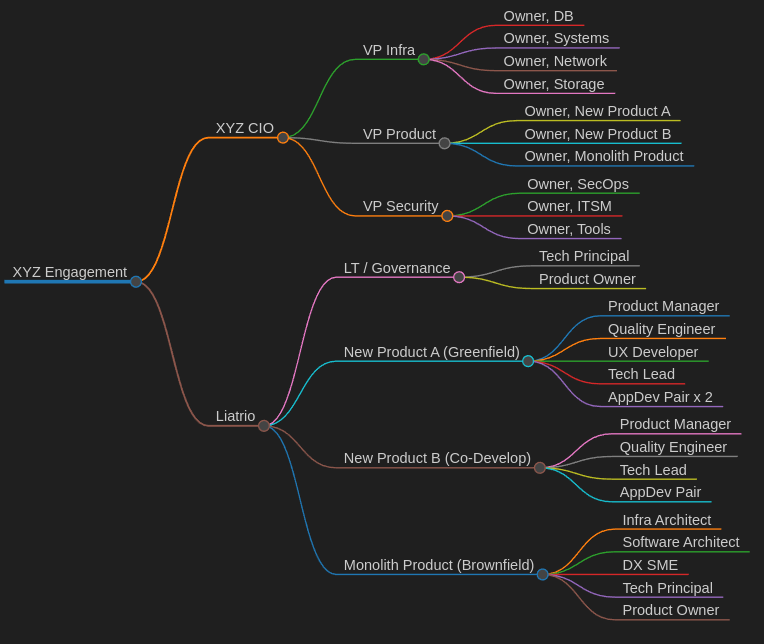

# General
## Architecture
Architecture was drawn using the [C4 model](https://www.c4model.com).  The diagrams found in [arch.drawio](./arch.drawio) can be opened using [draw.io](https://app.diagrams.net/).

## Setup
This repository was documented to be easily used with vscode, see [vscode.md](./vscode.md) for plugin installation.

# Engagement
## Structure 
Engagement structure and sample client stakeholders documented in [teams.md](./teams.md) were visualized with [markmap](https://markmap.js.org).



## Context
**1. What is your approach for exciting the customer to embark on the journey?**

Given initial findings:

```Developers have been complaining about kickstarting new environments, long lead times and cycles for development, and lack of consistency between their environments.```

Taking a platform approach to assist with fundamental infrastructure scaffoliding should increase environmental consistency, reduce developer friction/cognitive load, and allow developers to focus on delivering business value.  

```Operations has also been complaining about downtime during deployments and code quality being released into production.```

Given the client has a legacy operations model, [value stream mapping](https://www.atlassian.com/continuous-delivery/principles/value-stream-mapping) could be a useful way to understand the current journey, flow, and pain points.  As the client is trying to modernize, this context would be important for very likely framing a move to a DevOps culture and where exactly such a transformation would find dividends in the value stream.  Code quality, specifically, can be addressed as part of the development pipeline and measured by an assortment of tools to account for quality, test coverage, etc. 


**2. What do you need from the customer before kicking off the engagement ?**

Architecture diagrams, roadmaps, business objectives, regular access to stakeholders, and access to individual contributers as workflow demands.

**3. What is needed during the execution?**

Depends on the workstream - roadmaps and measurement against objectives can fit into any workstream, however if the client has a more tangible outcome (eg MVP release) then we'd need to iterate against those requirements.

**4. What is your scaling strategy?**

If applications and their components are designed modularly, scaling can be achieved by focusing on specific modules or capabilities.  If it was not, we instead need to find a way to break down complex workstreams into managble and specific goal-oriented outcomes that can be picked up by stand-alone teams.

**5. How will you measure success?**

For new product development, against the roadmaps given and the commitments made.  For modernization, by time-bound activities that should lead us in the direction of work that needs to be done or further evaluated.  With regard to operational efficiency, you can often use uptime, RPO, or any number of ticket releated metrics to indicate incremental success.

## Workstream Specifics
### Governance
Governance in this engagement is made up of:
- **Tech principal** - Functions as an enterprise architect who owns the overall engagement, both architecture and business, and ensures coherence across the development teams.
- **Product Owner** - Responsible for the workstreams below and reports status, resolves blockers/escalations, and works with client POs

### New Product A (Greenfield)
This is a net new workstream that starts from scratch and will develop using best/modern engineering practices.  While some of the roles may be allocated less than 100%, the role and its function should exist in some capacity.

### New Product A (Co-Develop)
This is a workstream that is being co-developed with the client.  They have had high turn-over and are largely just starting on their journey.  We have been engaged to help provide direction and clean up the practices which were already found to be generating large amounts of tech debt.  The product manager (shared or dedicated) and tech lead roles are intended to be filled by us, while there is flexibility with the staffing of other roles.

### Monolith Product (Brownfield)
This is a discovery workstream based on complaints around old products/code, stability, and difficulty both in product development as well as operationalization.  Goals will include:
1. Immediately identify and evaluate existing problems that are causing financial impact (outages, data loss, etc)
2. Identify and evaluate the architecture stack
3. Identify and quantify friction/waste/toil in the development stream
4. Identify and quantify friction/waste/toil in day-to-day operations
5. Propose a solution that can show incremental value against the above findings
6. Propose technologies, if needed, that would work in concert with the organization's existing tooling and their future business objectives.
7. Propose ways that we can help against the above findings (additional workstreams, devs, organizational change, etc)

A sample architecture for an engineering platform and it's touchpoints with other platforms/tools that wouldwork as we modernize and migrate the monolith has been included.
